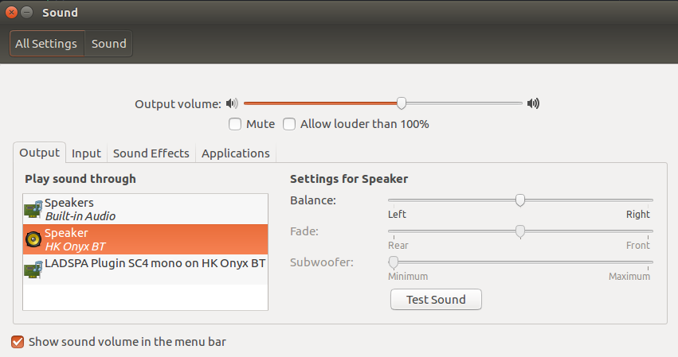
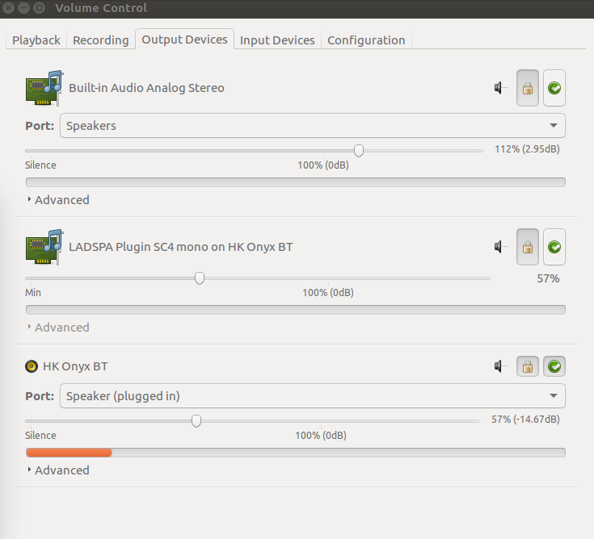

# dynamic_range_compression
Pulseaudio dynamic range compression on Ubuntu 16.04

# Dynamic Range Compression Notes:

This configures the pulseaudio `pavucontrol` to use the "Steve Harris" plugins to create a dynamic range compressor. This solves the problem of quiet dialog and loud explosions in movies. I turn this on for movies, and off for music. I happen to use a HK Onyx bluetooth speaker.

Packages:

1. pavucontrol - PulseAudio Volume Control
2. swh-plugins - Steve Harris's LADSPA plugins

Install both with `apt-get`.

Edit the default pulseaudio configuration: `/etc/pulse/default.pa` - with this addition to the end of the file. Reboot your laptop.

```
.ifexists module-ladspa-sink.so
.nofail
load-module module-ladspa-sink sink_name=compressor plugin=sc4m_1916 label=sc4m control=1,1.5,401,-30,20,5,12
.fail
.endif
```
## Usage

Once installed there will be a LADSPA audio option available in "Sound":



If you select the LADSPA as the output source you can see the compression effect in the PulseAudio volume contolr:


